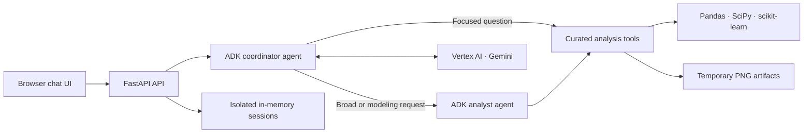

# Data Science AI Agent

A conversational data-science workspace built with the
[Google Agent Development Kit](https://google.github.io/adk-docs/) and Gemini 3.8 Flash. Select a
sample dataset or upload a CSV, ask questions in plain English, and receive evidence-backed
analysis, visualizations, cleaning proposals, and baseline models.

The application deliberately exposes curated analysis tools instead of arbitrary Python, SQL, or
shell execution. It is designed as a focused portfolio project that demonstrates agent delegation,
tool use, streaming progress, multi-turn context, and guarded model access.

## What it looks like

The browser interface keeps the active dataset visible while analysis happens in the conversation.
During a turn, it shows the analysis plan and live tool names—not raw tool responses or hidden model
reasoning. Tables, charts, metrics, warnings, and confirmation controls appear with the final answer.

### Relationship analysis

The analyst inspected the Iris dataset, measured pairwise relationships, ran a statistical test,
grouped measurements by species, and generated this correlation artifact:


### Baseline classification

In a follow-up turn, the same session compared dummy, logistic-regression, and random-forest
classifiers for `target_label`. Logistic regression reached 0.9333 holdout accuracy and the UI
rendered its metrics and confusion matrix inline:


Both examples above were generated during a real browser session on the included Iris sample—not
hand-authored demonstration data. Results are exploratory and can vary when the dataset changes.

## Browser-verified scenarios

| Scenario | Prompt or action | Verified behavior |
| --- | --- | --- |
| First use | Open the application | Chat and suggested prompts remain disabled until a dataset is selected |
| Sample selection | Select **Iris** | Sidebar shows 150 rows, 6 columns, and the inferred fields |
| Delegated analysis | “Find the most important relationships… and visualize them.” | Coordinator delegates to the analyst; seven tool steps stream before the grounded answer and heatmap |
| Multi-turn modeling | “Build a baseline classification model using `target_label`…” | Existing session context is retained; dummy, logistic regression, and random forest are compared |
| Safety language | Relationship and modeling questions | Results explicitly distinguish statistical association from causation |
| Tool privacy | Observe an active analysis | Only readable tool names and progress indicators appear; raw tool payloads remain hidden |

## Architecture



### Coordinator agent

The coordinator handles previews, missing-value checks, individual aggregations, filtering,
sorting, distributions, and charts directly. Broad EDA, driver investigation, statistical work,
and modeling are delegated to the analyst agent.

### Analyst agent

The analyst must record a concise plan before using analysis tools. It then inspects actual tool
results and returns a structured explanation with findings, evidence, warnings, assumptions,
artifacts, and useful follow-ups. It cannot apply a cleaning transformation without explicit user
confirmation.

### Curated toolset

- Preview, shape, schema inference, descriptive statistics, cardinality, missingness, and duplicates
- Identifier detection, filtering, sorting, grouping, aggregation, and distribution analysis
- Correlations, categorical associations, outlier summaries, and supported statistical tests
- Histogram, bar, line, scatter, box, and correlation-heatmap generation
- Preview-and-confirm cleaning for missing data, duplicates, type conversion, and outliers
- Guarded classification and regression baselines with preprocessing and diagnostic charts

There is no SQL-writing tool and no arbitrary code executor. Dataset operations run only through
the functions included in the application.

## Included datasets

The samples are bundled through scikit-learn and work offline:

| Dataset | Task |
| --- | --- |
| Iris | Multiclass classification |
| Wine | Multiclass classification |
| Breast Cancer | Binary classification |
| Diabetes | Regression |

## Run locally

Python 3.11+ and [`uv`](https://docs.astral.sh/uv/) are required.

```bash
uv sync --extra dev
mkdir -p .secrets
cp /path/to/service-account.json .secrets/vertex-service-account.json
make dev
```

Open [http://127.0.0.1:8765](http://127.0.0.1:8765).

The local credential directory is ignored by Git, Docker, and gcloud source uploads. Never commit
or copy a service-account key into the container. The project ID is read from the local credential
for development; Cloud Run uses its assigned runtime identity instead.

## Configuration and limits

Copy `.env.example` when you want to override a default.

| Variable | Default | Purpose |
| --- | --- | --- |
| `APP_ENV` | `development` | Enables production-only behavior when set to `production` |
| `GOOGLE_APPLICATION_CREDENTIALS` | `.secrets/vertex-service-account.json` | Local Vertex credential only |
| `GOOGLE_CLOUD_LOCATION` | `global` | Vertex AI location |
| `GOOGLE_MODEL` | `gemini-3.8-flash` | Coordinator and analyst model |
| `MAX_UPLOAD_MB` | `25` | Maximum UTF-8 CSV size |
| `MAX_DATASET_ROWS` | `100000` | Maximum uploaded rows |
| `MAX_DATASET_COLUMNS` | `200` | Maximum uploaded columns |
| `SESSION_TTL_MINUTES` | `60` | Inactive-session lifetime |
| `MAX_ACTIVE_SESSIONS` | `25` | In-memory sessions per instance |
| `MAX_TURNS_PER_SESSION` | `20` | Model-backed chat turns per session |
| `MAX_AGENT_TURNS_PER_HOUR` | `30` | Accepted turns per container in a rolling hour |
| `MAX_AGENT_TURNS_PER_DAY` | `100` | Accepted turns per container in a rolling 24 hours |
| `MAX_CONCURRENT_AGENT_TURNS` | `1` | Simultaneous model-backed turns per instance |
| `MAX_MODEL_OUTPUT_TOKENS` | `2048` | Output-token ceiling for each model response |
| `AGENT_TURN_TIMEOUT_SECONDS` | `180` | Application deadline for one chat turn |
| `ALLOWED_HOSTS` | local hosts and `*.run.app` | Accepted HTTP Host values |
| `EXPOSE_API_DOCS` | Local only | Serves `/docs` and `/openapi.json` outside production |

The hourly and daily counters are in memory and reset if Cloud Run replaces the container. They are
application brakes, not billing guarantees; pair them with Cloud quotas and billing alerts.

## Secure Cloud Run deployment

The included [Dockerfile](Dockerfile) runs one Uvicorn worker as a non-root user. The recommended
deployment requires authentication, scales to zero, allows at most one instance, throttles CPU
outside requests, and uses a dedicated Vertex-only runtime identity.

```bash
gcloud iam service-accounts create ds-agent-runtime \
  --project PROJECT_ID \
  --display-name "Data Science Agent runtime"

gcloud projects add-iam-policy-binding PROJECT_ID \
  --member "serviceAccount:ds-agent-runtime@PROJECT_ID.iam.gserviceaccount.com" \
  --role roles/aiplatform.user

gcloud run deploy data-science-ai-agent \
  --source . \
  --project PROJECT_ID \
  --region us-central1 \
  --service-account ds-agent-runtime@PROJECT_ID.iam.gserviceaccount.com \
  --no-allow-unauthenticated \
  --min-instances 0 \
  --max-instances 1 \
  --concurrency 2 \
  --cpu 1 \
  --memory 1Gi \
  --timeout 300 \
  --no-cpu-boost \
  --cpu-throttling \
  --set-env-vars APP_ENV=production,GOOGLE_CLOUD_PROJECT=PROJECT_ID,GOOGLE_CLOUD_LOCATION=global,GOOGLE_MODEL=gemini-3.8-flash,MAX_UPLOAD_MB=25,MAX_DATASET_ROWS=100000,MAX_DATASET_COLUMNS=200,MAX_ACTIVE_SESSIONS=25,MAX_TURNS_PER_SESSION=20,MAX_AGENT_TURNS_PER_HOUR=30,MAX_AGENT_TURNS_PER_DAY=100,MAX_CONCURRENT_AGENT_TURNS=1,MAX_MODEL_OUTPUT_TOKENS=2048
```

The current deployment is private. Making it public is a separate decision because anonymous users
could consume Vertex tokens. Before enabling unauthenticated access, configure a small billing
budget, lower Vertex request quotas where supported, and remember that ordinary billing budgets
notify rather than enforce a hard stop.

## API

<details>
<summary>HTTP endpoints</summary>

| Method | Endpoint | Purpose |
| --- | --- | --- |
| `POST` | `/api/sessions` | Create a temporary workspace |
| `DELETE` | `/api/sessions/{id}` | Delete a workspace and its artifacts |
| `GET` | `/api/samples` | List bundled datasets |
| `POST` | `/api/sessions/{id}/datasets/upload` | Upload a validated CSV |
| `POST` | `/api/sessions/{id}/datasets/sample` | Select a sample dataset |
| `GET` | `/api/sessions/{id}/dataset` | Read active dataset metadata |
| `POST` | `/api/sessions/{id}/chat` | Stream newline-delimited analysis events |
| `POST` | `/api/sessions/{id}/chat/cancel` | Request turn cancellation |
| `POST` | `/api/sessions/{id}/transformations/{proposal}/apply` | Confirm a cleaning proposal |
| `DELETE` | `/api/sessions/{id}/transformations/{proposal}` | Reject a cleaning proposal |
| `POST` | `/api/sessions/{id}/dataset/reset` | Restore the immutable original |

</details>

## Tests

```bash
make test
```

The standard suite mocks model behavior and does not call Vertex. Opt-in live tests are available:

```bash
RUN_VERTEX_SMOKE=1 uv run pytest -m vertex
```

The repository currently passes 23 tests, with the two Vertex smoke tests excluded by default.

## Scope

This is a single-user, temporary-data MVP. It has no durable history, login UI, notebook execution,
Excel support, database, or arbitrary code execution. Uploaded data and generated artifacts are
deleted when their session expires or the instance stops. Do not use exploratory findings or
baseline models as the sole basis for consequential decisions, and do not interpret association as
causation.
